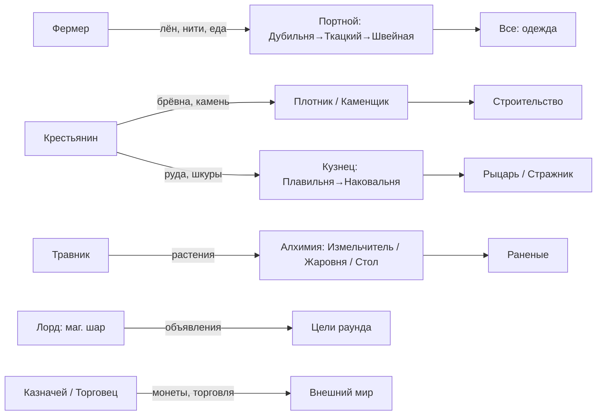

# Обзор: текущее состояние

Что реально заложено в прототипах на сегодня (`Roles/`, `Skill/`,
`Entities/Structures/Machine/`), как профессии связаны и где пробелы.

Основная идея: жизнь поселения держится на цепочке **навык → станок → материал → изделие**.

## Департаменты и профессии

Источник: `Resources/Prototypes/_Respiral/Roles/Jobs/departments.yml` и `Jobs/**`.

| Департамент (`id`) | Локаль | Профессии | Начальник |
|---|---|---|---|
| **MedievalNobles** (дворяне) | «Правители и приближённые» | Лорд, Рыцарь, Управляющий городом, Казначей | — / лорд |
| **MedievalCraftsman** (городские) | «Ремесленники, торговцы и стража» | Кузнец, Плотник, Каменщик, Инженер, Корчмарь, Травник, Горожанин, Торговец, Стражник | управляющему |
| **MedievalVillager** (деревенские) | «Жители села» | Староста, Фермер, Крестьянин | лорду / старосте |
| **MedievalCommoner** (другие, weight −10) | «Странники» | Переселенец (пилигрим) | местной власти |

Иерархия подчинения (`supervisors`): **Лорд** → Рыцарь / Управляющий / Казначей / Староста;
**Управляющий** → все ремесленники; **Староста** → Фермер, Крестьянин; **власть** → Пилигрим.

### Что каждая профессия «делает» сейчас

На данный момент профессия = **стартовая одежда + описание + место в иерархии**. Никакого стартового
навыка, книги или привязанного станка профессия не выдаёт (см. дыру №1 ниже). Ниже — заявленный
геймплейный замысел из локали и фактическая механика.

| Профессия | Замысел (job-description) | Фактическая механика на старте |
|---|---|---|
| Лорд | Правит землями, раздаёт поручения | корона, плащ, элитный костюм; связующий магический шар (объявления) |
| Рыцарь | Служит лорду, защищает владения | шлем, элитный металл-костюм; бой (навыки боя учатся в бою) |
| Управляющий | Распределяет работу ремесленников | шляпа с пером, костюм |
| Казначей | Ведёт казну, считает ресурсы | костюм; экономика — монеты/кошелёк, торговая консоль |
| Кузнец | Куёт инструменты, оружие, детали | рукавицы, худ, кожаные штаны (**навыка кузнеца НЕТ**) |
| Плотник | Заготавливает дерево, конструкции | рукавицы, худ, штаны (навыка обработки дерева НЕТ) |
| Каменщик | Обрабатывает камень, укрепления | рукавицы, худ, штаны (навыка обработки камня НЕТ) |
| Инженер | Обслуживает механизмы, конструкции | рукавицы, худ, штаны |
| Корчмарь | Держит корчму, кормит гостей | кожаные штаны |
| Травник | Ищет растения, готовит снадобья | худ, штаны (навыка алхимии НЕТ) |
| Горожанин | Живёт городской жизнью | худ, штаны |
| Торговец | Обменивает товары | шляпа торговца, штаны; торговая консоль |
| Стражник | Охраняет улицы | кольчуга, шлем, броня-штаны; бой |
| Староста | Руководит деревней | туника, худ, штаны |
| Фермер | Выращивает урожай | худ, штаны (флора/грядки) |
| Крестьянин | Работает на земле | худ, штаны |
| Переселенец | Путник из другого региона | худ, кожаные штаны (роль-«пассажир») |

## Навыки

Источник: `Skill/skill.yml`. Все навыки: `pointsNeeded: 100`, мастерство при прогрессе ≥ 1.0.

**Ремесло** (учатся по книгам, `LearnSkillWhenUsing` +0.01/использование → 100 прочтений до мастерства):

| Навык | Книга | Гейтит станки |
|---|---|---|
| MedievalWoodProcessing (обработка дерева) | ✅ книга | Пилорама, Стол плотника |
| MedievalStoneProcessing (обработка камня) | ✅ книга | Каменоломня |
| MedievalBasicBlacksmithing (кузнечное дело) | ✅ книга | Плавильня, Наковальня |
| MedievalTailor (портное дело) | ✅ книга | Дубильня, Ткацкий станок, Швейная машина |
| MedievalAlchem (алхимия) | ✅ книга | Алхимический стол |
| MedievalJewelry (ювелирное дело) | ✅ книга | Станок ювелира |
| MedievalLiteracy (грамотность) | ✅ книга | письмо пером; чтение бумаги (градиент) |

**Бой** (учатся в бою через `NeededSkillForMelee`, книг НЕТ):
MedievalOneSword (одноручный клинок), MedievalDagger (кинжал), MedievalMace (булава/дубина),
MedievalFistFight (кулачный бой), MedievalWhip (плеть), MedievalAncientWeapons (древковое оружие).

## Станки

Источник: `Entities/Structures/Machine/*.yml`, рецепты — `Recipe/packs.yml`.
Общий конструкционный граф `MedievalMachine` (каркас → механизм → станок).
Гейт по навыку — компонент `NeededSkillForInteract` (не блокирует NPC без `SkillComponent`).

| Станок | Навык-гейт | Вход | Выход (рецепты) |
|---|---|---|---|
| **Пилорама** (`MedievalSawmill`) | Дерево | брёвна | доски, деревянные стержни |
| **Стол плотника** (`MedievalCarpenterTable`) | Дерево | доски | вёдра, швабры, кружки, **детали станков**, деревянные плитки пола |
| **Каменоломня** (`MedievalQuarry`) | Камень | камень | каменные/мраморные плитки пола |
| **Плавильня** (`MedievalSmelter`) | Кузнечное | руда | слитки (железо→адамантий), бутыли |
| **Наковальня** (`MedievalAnvil`) | Кузнечное | слитки | оружие, броня, инструменты, замки/ключи, монеты, посуда, канделябры |
| **Дубильня** (`MedievalTannery`) | Портное | шкуры | обработанная шкура |
| **Ткацкий станок** (`MedievalLoom`) | Портное | нити/шкуры | ткань |
| **Швейная машина** (`MedievalSewing`) | Портное | ткань | одежда, сумки, пояса, простыни, ковры |
| **Станок ювелира** (`MedievalJeweler`) | Ювелирное | — | ⚠️ **пустой пак рецептов** (не функционирует) |
| **Алхимический стол** (`MedievalAlchemTable`) | Алхимия | реагенты | ChemMaster — таблетки/бутыли |
| **Жаровня** (`MedievalHotplate`) | — (не гейтится) | колбы | нагрев раствора (160/с) |
| **Магический измельчитель** (`MedievalReagentGrinder`) | — (не гейтится) | реагенты | измельчение/сок |
| **Связующий магический шар** (`MedievalConnectingMagicBall`) | — | — | консоль объявлений поселению |

## Как профессии связаны между собой

Ключевая идея темы Respiral (жизнь/смерть/возрождение) на профессии пока прямо не заведена — цикл
«сырьё → изделие → износ (`Wear`) → переплавка/утиль» существует технически, но не оформлен как явный
геймплейный луп профессии.

## Обнаруженные дыры и риски

1. **Профессия ≠ навык.** Ни один `startingGear` не выдаёт ни навыка, ни книги, ни станка.
   Кузнец без навыка кузнеца не может работать на наковальне, пока не прочтёт книгу ~100 раз.
   Итог: роли сейчас чисто косметические; любой игрок с книгой = любой ремесленник.
   → Решить: выдавать стартовый прогресс навыка / книгу / доступ по профессии, либо оставить
   «все учатся с нуля» как осознанный дизайн (тогда прописать это в диздоке).
2. **Станок ювелира не работает** — `MedievalJeweler` имеет `recipes: []`. Профессия ювелира не
   упоминается в департаментах вовсе (навык есть, роли нет).
3. **Профессии без петли геймплея:** Горожанин, Корчмарь, Стражник, Инженер, Крестьянин, вся Знать —
   не имеют выделенной механики/навыка (Инженер логически = обработка дерева/строительство, но не
   привязан). Корчмарь без кухни/бара-контента.
4. **Боевые навыки без книг** — учатся только в бою; нет «тренировки». `MedievalAncientWeapons`
   имеет опечатку в имени навыка («древкое»).
5. **Алхимия гейтится лишь частично** — Стол требует навык, а Измельчитель и Жаровня открыты всем.
6. **Открытые NPC-обходы гейтов** — намеренно (NPC без `SkillComponent` не блокируются), но это
   надо учитывать при балансе (мобы-ремесленники).
7. **Департамент Commoner weight −10** — пилигрим намеренно «на дне» списка; проверить, что это
   ожидаемо для лобби.
